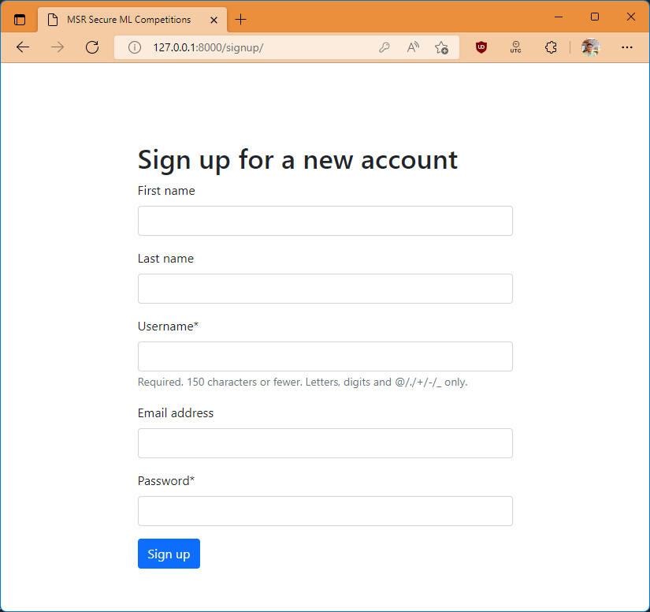
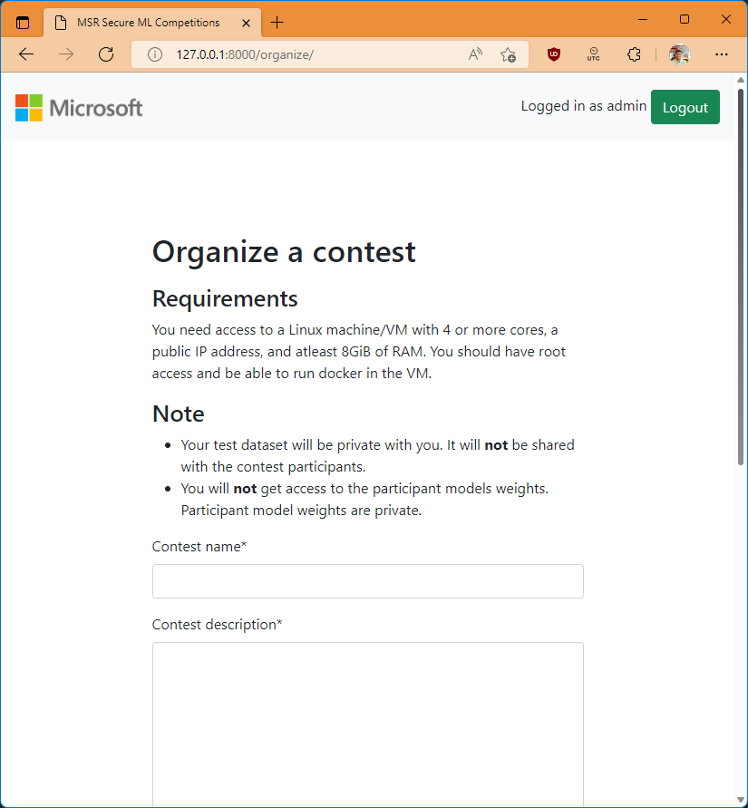

# User guide

This guide will explain step-by-step how to organize and participate in a contest using this Django application.

## Pre-requisites

You need minimum 3 VMs for this - for website, organizer and participant. All 3 can be the same PC for local development ( for example 3 WSL terminal sessions on Windows ) or separate machines in production.

The IP addresses are denoted as  `IP1`, `IP2`, `IP3` ( will be 127.0.0.1 for all 3 in case of local development ).

You need to open any ports used in the demo so the ports are accessible from outside the VM.

## Suggested Article

If you have your files etc locally, and you want to copy them to the docker containers that you create, follow [this article](https://www.geeksforgeeks.org/copying-files-to-and-from-docker-containers/) to learn how.

Another simple way is to push your content to a GitHub repository and clone it inside the docker container.

## Setting up the website

Setup the website according to [setup section of Readme](README.md#setup). In this guide, the `WEBSITE_URL` in setup.py will be `http://IP1`

After setting it up, start the website by running `python manage.py runserver`.

## Organizing the contest

1. Create an account on the wesbsite by going to `http://IP1/signup`

1. Go to `/signup` to create an account and login.  

1. At the home page, click on Organize Contest button to create a contest.

1. At the organize page, enter the contest details  
Contest Name: `ImageNet Inference Contest`
Contest Description: Copy all the text from [readme_files/contest_description.md.](readme_files/contest_description.md) The markdown is converted to HTML by the website.  
Train Dataset: Select [readme_files/train_dataset.zip](readme_files/train_dataset.zip) for upload. This just contains a text file with link to the actual labelled dataset.  
End Date: `15 June 2035`  
Num testcases: `5`  
Access key: This is not used at this time, keep it to anything.  
Num classes: `1000`  

1. Click organize contest. Then go to home and click "Manage contest".

1. Follow the steps there to start the organizing server. You need to copy the `dataset` folder and `labels.txt` file from `readme_files` folder into the organizer VM so it can be used for evaluation. The `dataset` folder contains 5 images ( without extensions ) which will be used for inference. `labels.txt` contains ImageNet labels of the 5 images.

## Participate in the contest

1. Go to the contest details page.

1. Scroll down and click "Submit your entry".

1. You can use the `model.onnx`, `config.json` and `pre_process.py` files located in the `readme_files` folder for your submission. The model is the ShuffleNet V2 Model available at ONNX Zoo. You'll also need to copy these files to the participant VM to run inference.

1. Submit the files and follow the instructions shown to get your submission evaluated.

